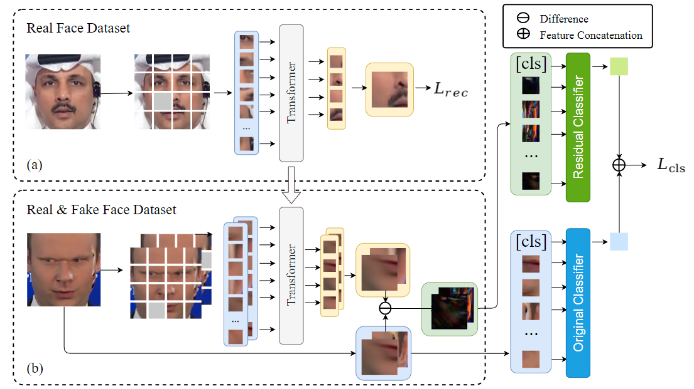

# Real Face Foundation Representation Learning for Generalized Deepfake Detection

This repository is the official implementation of [Real Face Foundation Representation Learning for Generalized Deepfake Detection](https://arxiv.org/abs/2303.08439). 

The paper is published at [*Pattern recognition*](https://www.sciencedirect.com/science/article/abs/pii/S0031320324010501) in Dec 2024.

## Overview

In this study, we propose Real Face Foundation Representation Learning (RFFR), which aims to learn a general representation from large-scale real face datasets and detect potential artifacts outside the distribution of RFFR. 




## Preparations

- To install requirements:

```setup
pip install -r requirements.txt
```

- Download datasets at [FaceForensics++](https://github.com/ondyari/FaceForensics), [ForgeryNet](https://yinanhe.github.io/projects/forgerynet.html), [Celeb-DF](https://github.com/yuezunli/celeb-deepfakeforensics), etc.

- Run face detection. With cropped face images, generate json files in the following format:

```
[
    {
        "path": "path/to/image_0.png",
        "label": 0
    },

    {
        "path": "path/to/image_1.png",
        "label": 1
    },

    ...
]

```

- Link the json files in the config files to load the data. You can also just modify the dataset files to load the images in any other ways you want.


## Training

Make sure to specify paths to labels, pretrained models, as well as hyperparameters in ```rffr_classifier/configs/config.py``` and ```rffr_generative/configs/config.py```.

To train the generative model that produces residuals:

```train
cd rffr_generative
python train.py
```

To train the classifier:

```train
cd rffr_classifier
python train.py
```


## Evaluation

Specify models to test in the aforementioned config files.

View demos of the generative model's output by running:

```eval
cd rffr_generative
python evaluate.py
```

Test the deepfake detector by running:

```eval
cd rffr_classifier
python test.py
```


## Acknowledgements

This repository partially borrows from [SSDG](https://github.com/taylover-pei/SSDG-CVPR2020) (for code structure) and [MAE](https://github.com/facebookresearch/mae) (for implementation of the generative model). Thank you!

## Reference
Consider citing our paper if you find it helpful:

```
@article{shi2024real,
  title={Real face foundation representation learning for generalized deepfake detection},
  author={Shi, Liang and Zhang, Jie and Ji, Zhilong and Bai, Jinfeng and Shan, Shiguang},
  journal={Pattern Recognition},
  pages={111299},
  year={2024},
  publisher={Elsevier}
}
```

Feel free to contact us with any comments or feedback.
